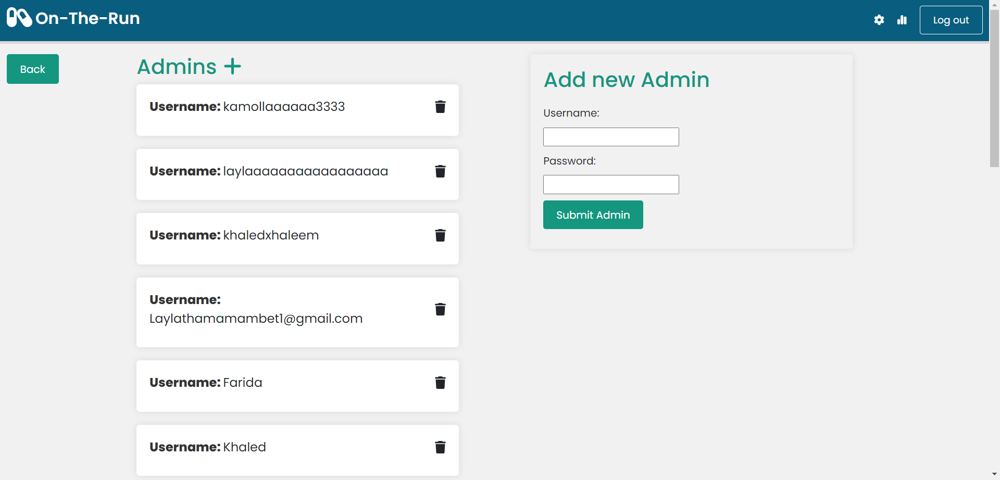
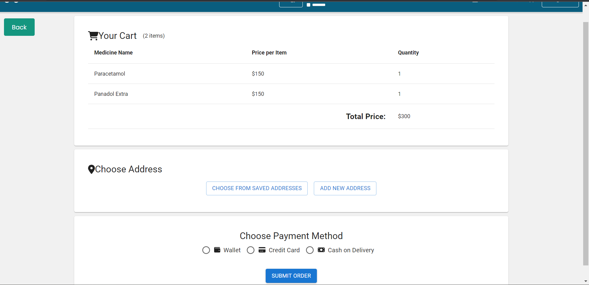
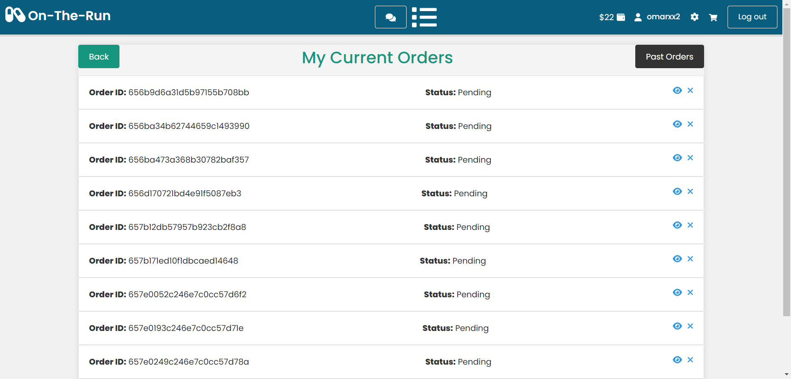
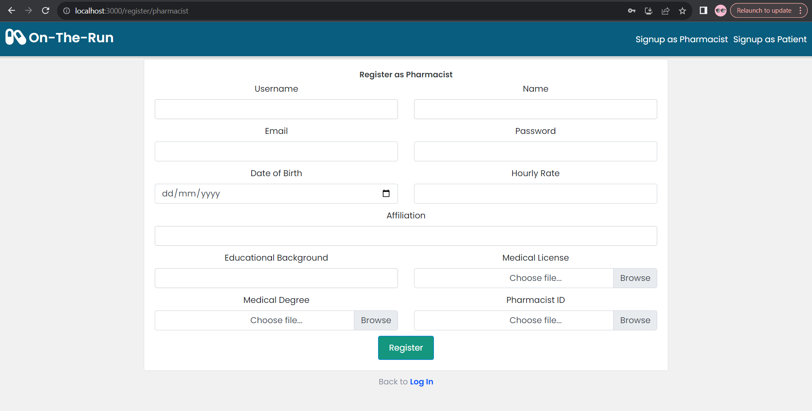
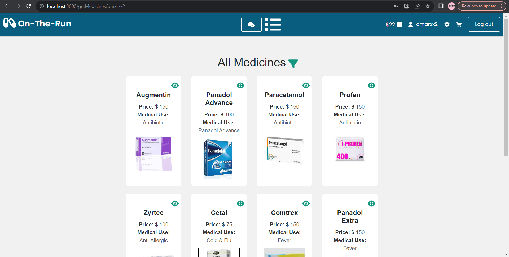
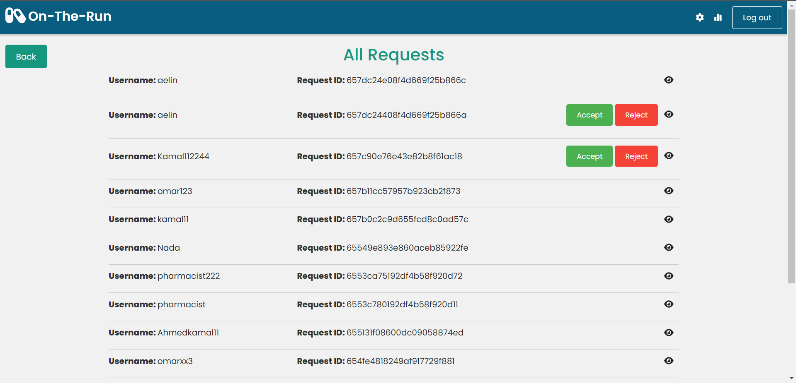

# On-The-Run-Pharmacy

## Summary

On-The-Run-Pharmacy is a comprehensive web platform that bridges the gap between patients, pharmacists, and administrators, revolutionizing the pharmaceutical experience. The platform facilitates patient registration, pharmacist enrollment, and seamless administration for a holistic healthcare journey.

## Motivation

On-The-Run-Pharmacy is born out of the necessity to streamline pharmaceutical processes and enhance accessibility for patients. Traditional methods face challenges in medicine management, sales reporting, and patient engagement. The project aims to overcome these hurdles by providing a digital space where patients can easily access medicines, pharmacists can efficiently manage their inventory, and administrators can oversee the entire system cohesively.

The goal is to create a user-friendly and secure environment that ensures patients have convenient access to medicines, pharmacists have robust tools for inventory management, and administrators have the means to administer the platform effectively.

In summary, On-The-Run-Pharmacy strives to bring innovation to the pharmaceutical industry, offering a modern, accessible, and efficient solution for patients, pharmacists, and administrators alike.

## Features

On-The-Run-Pharmacy offers a range of features designed to optimize pharmaceutical interactions. Here are some key functionalities:

1. **User Registration:**
   - Patients and pharmacists can register with essential details, creating personalized accounts for a tailored experience.

2. **Request for Pharmacist Registration:**
   - Aspiring pharmacists can submit registration requests, providing necessary professional details for approval.

3. **Authentication and Password Management:**
   - Robust password validation ensures secure authentication, and users can change and reset passwords.

4. **Admin Tools:**
   - Administrators can add new administrators, remove users, view pharmacist requests, and accept/reject pharmacist registrations.

5. **Medicine Management:**
   - Patients and pharmacists can view a comprehensive list of available medicines, search based on various criteria, and access detailed information including images, prices, and descriptions.

6. **Inventory Management for Pharmacists:**
   - Pharmacists can manage medicine quantities, sales, add new medicines, upload medicine images, and edit details.

7. **Sales Reports:**
   - Administrators can generate total sales reports for a chosen month and pharmacists can filter reports based on medicine/date.

8. **Order and Cart Management for Patients:**
   - Patients can add medicines to their cart, view and edit cart items, checkout orders, and view current/past orders.

9. **Wallet System:**
   - Patients can view the amount in their wallet, choose wallet payment during checkout, and receive refunds for canceled orders.

10. **Chat Functionality:**
    - Patients and pharmacists can engage in secure chat sessions with doctors and each other.

11. **Notification System:**
    - Pharmacists receive notifications when medicines are out of stock, and patients receive alternative suggestions for out-of-stock items.

On-The-Run-Pharmacy strives to be a catalyst in transforming pharmaceutical interactions, providing a seamless experience for patients, pharmacists, and administrators.

## Performance Issues and Bugs

**Note**: The two websites (On-The-Run-Pharmacy and On-The-Run-Clinic) are currently not linked. This is due to ongoing development efforts to establish the necessary connections and ensure a seamless experience between the platforms. We appreciate your patience and understanding as we work towards integrating these components. Updates on the linking progress will be communicated in subsequent releases.

- **Long Processing Time**: The website currently experiences delays in fetching information from MongoDB using Mongoose. Efforts are underway to optimize database queries and enhance overall performance.

Your understanding and patience as we address these issues are greatly appreciated.

## Code Style

The code follows React JavaScript coding conventions with the following notable aspects:

- **Import Statements:** Organized at the top of the file, each on a new line. External libraries are imported using a direct import statement (`import {...} from '...'`).

- **Component Definition:** Arrow function syntax is used for functional components with React hooks (`useState`, `useEffect`).

- **CSS Styling:** Inline styles are used within the JSX for styling components.

- **Variable Naming:** Generally clear and follows camelCase conventions.

- **Async/Await:** Asynchronous operations are handled using the `async/await` syntax.

- **Linking:** React Router's `Link` component is used for navigation.

- **Icons:** FontAwesome icons are used for visual elements.

If you're contributing to the project, please follow these conventions to maintain code consistency.

## Screenshots

Here are some screenshots that showcase how On-The-Run-Pharmacy looks and works:


*Add Admin page*


*patient viewing the checkout page*


*patient viewing his current orders*


*Pharmacist registeration page*


*patient viewing medicines*


*Admin viewing pharmacists requests*


## Tech/Framework Used

The On-The-Run-Pharmacy project is built using the following technologies and frameworks:

- **React:** The frontend of the application is developed using the React library, providing a dynamic and responsive user interface.

- **Node.js:** The backend is powered by Node.js, ensuring efficient server-side processing and communication.

- **MongoDB:** As a NoSQL database, MongoDB is used to store and manage the project's data, providing scalability and flexibility.

- **Express:** The application utilizes the Express framework for building robust and scalable server-side applications.

- **Stripe:** For secure online payment processing, the Stripe API is integrated to handle credit card transactions.

- **FontAwesome:** Icons used in the user interface are sourced from FontAwesome, adding visual elements to the design.

- **Axios:** The Axios library is employed for making HTTP requests, ensuring seamless communication between the frontend and backend.

- **React Router:** Navigation within the React-based application is managed using React Router, providing a single-page application experience.


## Code Examples

### viewing, accepting and rejecting pharmacists requests to join the pharmacy
Accepting or rejecting a health package involves sending a post request, viewing requests involves making a get request

```javascript
//admin viewing,accepting,rejecting pharmacists requests to join the pharmacy
import React, { useState, useEffect } from 'react';
import axios from 'axios';
import BeatLoader from "react-spinners/BeatLoader";
import { faEye} from '@fortawesome/free-solid-svg-icons';
import { FontAwesomeIcon } from '@fortawesome/react-fontawesome';
import { Link } from 'react-router-dom';
import { useNavigate } from 'react-router-dom';
import RequestModal from '../components/RequestModal';

import './MedicineList.css'; // Import your CSS file for styling

const RequestsListPage = () => {
  const [requests, setRequests] = useState([]);
  const [loading, setLoading] = useState(true);
  const [isProcessing, setIsProcessing] = useState(false);
  const [modalOpen, setModalOpen] = useState(false);
  const [request, setRequest] = useState("");
  const [activeRequestId, setActiveRequestId] = useState(null);

  
  const navigate = useNavigate();
  
 

  const fetchRequests = async () => {
    try {
      const response = await axios.get(`http://localhost:4000/getRequests`,{
        withCredentials: true
      });

      if (response.status === 200) {
        setRequests(response.data);
      }
      
    } catch (error) {
      console.error('Error fetching requests:', error);
    } finally {
      setLoading(false);
    }
  };

  useEffect(() => {
    fetchRequests();
  }, []);
  const handleAccept = async (reqid,username,password,name,email,hourly_rate,affiliation,educational_background,Working_license,Pharmacy_degree) => {
    try {
      const response = await axios.post(`http://localhost:4000/acceptPRequest/${username}/${password}/${name}/${email}/${hourly_rate}/${affiliation}/${educational_background}/${Working_license}/${Pharmacy_degree}`,{},{
        withCredentials: true
      });
      await axios.put(`http://localhost:4000/acceptPRequest/${reqid}`,{},{
        withCredentials: true
      });
      if (response.status === 200) {
        setRequests(requests.filter((r) => r._id !== reqid));
      }
      fetchRequests();
    } catch (error) {
      console.error('Error accepting request:', error);
    }
  };

  
  
  const handleReject = async (reqid) => {
    try {
      // Make a DELETE request to the backend to delete the patient
      await axios.put(`http://localhost:4000/rejectPRequest/${reqid}`,{},{
        withCredentials: true
      });

      // After successful deletion, refresh the patient list by re-fetching
      fetchRequests();
    } catch (error) {
      console.error('Error rejecting doctor request:', error);
    }
  };

  useEffect(() => {
    fetchRequests();
  }, []);


return (
  <div className="container">
    <div className="patients-list">
      <h2>All Requests</h2>


      {loading ? (
        <div className="spinner-container">
          <BeatLoader color="#14967f" size={15} />
        </div>
      ) : requests.length === 0 ? (
        <p>No Requests found</p>
      ) : (
        <ul className="patients-list">
          {requests.map((m) => (
            <li key={m._id}>
              <div className="patients-header">
                <div style={{ flex: 1, textAlign: 'left' }}>
                  <strong>Username: </strong>{m.username}
                </div>
                <div style={{ flex: 1, textAlign: 'left' }}>
                  <strong>Request ID: </strong>{m._id}
                </div>
                <div style={{ flex: 1, textAlign: 'right', marginRight: '10px' }}>
                  {m.statuss === 'Pending' && (
                    <>
                      <button
                       disabled={isProcessing}
                        style={{
                          backgroundColor: '#4CAF50', /* Green */
                          border: 'none',
                          color: 'white',
                          padding: '10px 20px', // Reduced padding
                          textAlign: 'center',
                          textDecoration: 'none',
                          display: 'inline-block',
                          fontSize: '14px', // Reduced font size
                          margin: '4px 2px',
                          cursor: 'pointer',
                        }}
                        onClick={() => handleAccept( m._id,m.username,m.password,m.name,m.email,m.hourly_rate,m.affiliation,m.educational_background,m.Working_license,m.Pharmacy_degree)}
                      >
                        Accept
                      </button>
                      <button
                       disabled={isProcessing}
                        style={{
                          backgroundColor: '#f44336', /* Red */
                          border: 'none',
                          color: 'white',
                          padding: '10px 20px', // Reduced padding
                          textAlign: 'center',
                          textDecoration: 'none',
                          display: 'inline-block',
                          fontSize: '14px', // Reduced font size
                          margin: '4px 2px',
                          cursor: 'pointer',
                        }}
                        onClick={() => handleReject(m._id)}
                      >
                        Reject
                      </button>
                    </>
                  )}
                  <FontAwesomeIcon
                    className="view-icon"
                    icon={faEye}
                    style={{ marginLeft: '10px' }}
                    onClick={() => {
                      setModalOpen(true);
                      setRequest(m);
                      setActiveRequestId(m._id)
                      
                    }}
                  />

                </div>
              </div>
            </li>

          ))}
        </ul>
      )}
    </div>
    {modalOpen && request &&
      <RequestModal
        setOpenModal={setModalOpen}
        request={request}
      />
    }
  </div >
);
};

export default RequestsListPage;
```

### Patient Registeration 
The registeration of a patient involves sending a POST request to the server with the necessary patient details.
```javascript

import React,{ useState } from 'react';
import { Link,useNavigate } from 'react-router-dom';
import axios from 'axios';
import { Form, Button, Card, Spinner, Container, Row, Col } from 'react-bootstrap';

const PatientRegistration = () => {
    const navigate = useNavigate();

    const[username,setUsername]=useState('')
const[name,setName]=useState('')
const[email,setEmail]=useState('')
const[password,setPassword]=useState('')
const[date_of_birth,setDateOfBirth]=useState('')
const[gender,setGender]=useState('')
const[mobile_number,setMobileNumber]=useState('')
const [emergency_contact, setEmergencyContact] = useState({
    full_name: '',
    mobile_number: '',
    relation_to_patient:''
  });

  const [error, setError] = useState(null);
  const [isRequestPending, setIsRequestPending] = useState(false);

  


    const handleSubmit = async (e) => {
        e.preventDefault();
        const p={username,name,email,password,date_of_birth,gender,mobile_number,emergency_contact}
        try {
          // Make a POST request to your backend API endpoint
          const response = await axios.post('http://localhost:4000/register/patient', p,{
            withCredentials: true
          });
      
          if (response.status === 201) {
            console.log('Registration successful:', response.data);
            setUsername('');
            setName('');
            setEmail('');
            setPassword('');
            setDateOfBirth('');
            setGender('Male');
            setMobileNumber('');
            setEmergencyContact({ full_name: '', mobile_number: '' });
            setError(null);
            navigate(`/login`);
           
          }
          else {
            console.error('Registration failed:', response.data);
            setError('Registration failed. Please check your data and try again.');
          }
        } catch (error) {
          console.error('Registration failed:', error);
          setError('Registration failed. Please try again later.');
        }
      };

  return (
    <Container style={{ display: 'flex', justifyContent: 'center', alignItems: 'center', height: '87vh', flexDirection: 'column' }}>
      <Card style={{ height: '85vh' }}>
        <Card.Body>
          <h4 style={{ fontSize: '15px', fontWeight: '600', color: '#343a40', marginBottom: '5px' }}>Register as Patient</h4>
          {error && <p>{error}</p>}
          {isRequestPending ? (
            <p>Registration request is pending. Please wait for approval.</p>
          ) : (
            <Form onSubmit={handleSubmit}>
              <Row>
                <Col>
                  <Form.Group controlId="username">
                    <Form.Label>Username</Form.Label>
                    <Form.Control type="text" value={username} onChange={(e) => setUsername(e.target.value)} required />
                  </Form.Group>
                </Col>
                <Col>
                  <Form.Group controlId="name">
                    <Form.Label>Name</Form.Label>
                    <Form.Control type="text" value={name} onChange={(e) => setName(e.target.value)} required />
                  </Form.Group>
                </Col>
              </Row>
              <Row>
                <Col>
                  <Form.Group controlId="email">
                    <Form.Label>Email</Form.Label>
                    <Form.Control type="email" value={email} onChange={(e) => setEmail(e.target.value)} required />
                  </Form.Group>
                </Col>
                <Col>
                  <Form.Group controlId="password">
                    <Form.Label>Password</Form.Label>
                    <Form.Control type="password" value={password} onChange={(e) => setPassword(e.target.value)} required />
                  </Form.Group>
                </Col>
              </Row>
              <Row>
                <Col>
                  <Form.Group controlId="dateOfBirth">
                    <Form.Label>Date of Birth</Form.Label>
                    <Form.Control type="date" value={date_of_birth} onChange={(e) => setDateOfBirth(e.target.value)} required />
                  </Form.Group>
                </Col>
                <Col>

                  <Form.Group controlId="gender">
                    <Form.Label>Gender</Form.Label>
                    <Form.Check
                      type="radio"
                      label="Male"
                      name="gender"
                      value="Male"
                      checked={gender === 'Male'}
                      onChange={(e) => setGender(e.target.value)}
                      required
                    />
                    <Form.Check
                      type="radio"
                      label="Female"
                      name="gender"
                      value="Female"
                      checked={gender === 'Female'}
                      onChange={(e) => setGender(e.target.value)}
                      required
                    />
                  </Form.Group>
                </Col>
              </Row>
              <Row>
                <Col>
                  <Form.Group controlId="mobileNumber">
                    <Form.Label>Mobile Number</Form.Label>
                    <Form.Control type="tel" value={mobile_number} onChange={(e) => setMobileNumber(e.target.value)}   required />
                  </Form.Group>
                </Col>

              </Row>
              <Row>
                <Col>
                  <Form.Group controlId="emergencyContact.fullName">
                    <Form.Label>Emergency Contact Name</Form.Label>
                    <Form.Control type="text" value={emergency_contact.full_name} onChange={(e) => setEmergencyContact({ ...emergency_contact, full_name: e.target.value })} required />
                  </Form.Group>
                </Col>
                <Col>
                  <Form.Group controlId="emergencyContact.mobileNumber">
                    <Form.Label>Emergency Contact Mobile</Form.Label>
                    <Form.Control type="tel" value={emergency_contact.mobile_number} onChange={(e) => setEmergencyContact({ ...emergency_contact, mobile_number: e.target.value })} required />
                  </Form.Group>
                </Col>
              </Row>
              <Row>
                <Col>
                  <Form.Group controlId="emergencyContact.relationToPatient">
                    <Form.Label>Emergency Contact Relation</Form.Label>
                    <Form.Control type="text" value={emergency_contact.relation_to_patient} onChange={(e) => setEmergencyContact({ ...emergency_contact, relation_to_patient: e.target.value })} required />
                  </Form.Group>
                </Col>

              </Row>

              <Button variant="primary" type="submit" disabled={isRequestPending} style={{ marginTop: '10px' }}>
                {isRequestPending ? <Spinner animation="border" size="sm" /> : 'Register'}
              </Button>
            </Form>
          )}
        </Card.Body>
      </Card>
      <p style={{ color: '#8a90a2', fontSize: '15px', fontWeight: '400' }}>Back to <Link to="/login" style={{ color: '#0055ff', fontSize: '15px', fontWeight: '600' }}>Log In</Link></p>
    </Container>
  );
};

export default PatientRegistration;

```
## Installation
 ### prerequisites
   1. **Node.js and npm:**
     - Ensure you have Node.js installed on your machine. You can download it [here](https://nodejs.org/).

   2. **MongoDB:**
     -[here](https://www.mongodb.com/).
   3. **Git:**
     -[here](https://git-scm.com/).

### Clone the Repo
  ```bash
 git  https://github.com/advanced-computer-lab-2023/On-The-Run-Pharmacy.git
```
#### To run the backend:
```bash
cd backend_pharmacy
npm run dev
```
#### To run the frontend:
```bash
cd frontend
npm start
```
## API Reference
```javascript
app.post('/register/patient',createPatientP)
app.post("/createRequest",createRequest)
app.post("/createMessage",createMessage)
app.get("/getChatMessages/:username/:doctor",getChatMessages)
app.post("/sendMessageAsPharmacist",sendMessageAsPharmacist)
app.post("/sendMessageAsPatient",sendMessageAsPatient)
app.post("/createCrossMessage",createCrossMessage)
app.get("/getCrossChatMessages/:username/:doctor",getCrossChatMessages)
app.post("/sendCrossMessageAsPharmacist",sendCrossMessageAsPharmacist)
app.get("/getMedicines",getMedicines)
app.get("/getAlternativeMedicines",getAlternativeMedicines)
app.get("/getMedicines2",getMedicines2)
app.get("/getNotifications",getNotifications)
app.post("/addMedicine",addMedicine)
app.get("/getMed/:id",getMedicine)
app.put("/updateMed/:id/:medicalUse/:description/:price/:available_quantity",updateMedicine)
app.put("/archiveMedicine/:id",archiveMedicine)
app.put("/unarchiveMedicine/:id",unarchiveMedicine)
app.post("/addAdmin",requireAuthAdmin,createAdmin)
app.get("/getPatients",requireAuthAdmin,getPatientsP)
app.delete("/deletePatient/:id",requireAuthAdmin,deletePatientP)

app.get("/getPharmacist",requireAuthAdmin,getPharmacists)
app.get("/getOrderDetails/:orderId",getOrderDetails)
app.get("/getPharmacists2",getPharmacists2)
app.delete("/deletePharmacist/:id",requireAuthAdmin,deletepharmacist)
app.post("/addToCart",requireAuthPatient,addToCart)

app.get("/getRequests",requireAuthAdmin ,getRequests)
app.put("/acceptPRequest/:id",requireAuthAdmin,acceptrequest);
app.put("/rejectPRequest/:id",requireAuthAdmin,rejectrequest);
app.post("/acceptPRequest/:username/:password/:name/:email/:hourly_rate/:affiliation/:educational_background/:Working_license/:Pharmacy_degree",requireAuthAdmin,createPharmacist1)
app.put("/addAddress/:username/:address",requireAuthPatient,addAddress);
app.get("/getAddresses/:username",requireAuthPatient,getAddresses);
app.post('/login', login)
app.get('/logout', logout);
app.get('/getOutOfStockMedicines', getOutOfStockMedicines);
app.get("/getPatientCart/:username",requireAuthPatient,getPatientCart)
app.delete("/deleteFromCart/:username/:medicineId",requireAuthPatient,deleteFromCart)
app.put("/updateCart/:username/:medicineId/:newAmount",requireAuthPatient,updateCart)
app.get("/getPatientByUsername/:username",getPatientByUsername);
app.put("/updatePassPatient",updatePasswordPatient);
app.get("/getPharamcistByUsername/:username",getPharmacistByUsername);
app.put("/updatePassPharmacist",updatePasswordPharmacist);
app.get("/getAdminByUsername/:username",getAdminByUsername);
app.put("/updatePassAdmin",updatePasswordAdmin);
app.post("/createOrder/:username/:statuss/:shippingAddress/:paymentMethod/:totalprice",requireAuthPatient,createOrder);
app.put("/cancelOrder/:orderId",requireAuthPatient,cancelOrder);
app.put ("/updateWallet/:username/:amount",updateWallet);
app.get ("/getWallet/:username",getWallet);
app.get("/getPatientOrders/:username",requireAuthPatient,getPatientOrders);
app.get("/getPastOrders/:username",requireAuthPatient,getPastOrders);
app.get("/getCurrentOrders/:username",requireAuthPatient,getCurrentOrders);
app.post("/forgetPassword",forgetPassword);
app.post("/resetPassword/:username",resetPassword);
app.get("/getPharmaWallet/:username",requireAuthPharmacist,getPharmaWallet)
app.post("/updateMedQuantity/:id/:amount",updateMedQuantity);
app.get("/getMedicinesWithSales",getMedicinesWithSales);
app.post("/createsales/:medicine_id/:amount",createSales);
app.get("/getSales",getSales);
app.get("/getAdmins",requireAuthAdmin,getAdmins)
app.delete("/deleteAdmin/:id",requireAuthAdmin,deleteAdmin);
```

## Tests

The On-The-Run-Pharmacy project includes a set of tests to ensure the reliability and functionality of its features. Postman was used for testing the API endpoints.

### Running Tests

To run the tests, follow these steps:

1. **Install Postman:**
   - If you don't have Postman installed, download and install it from [Postman's official website](https://www.postman.com/).

2. **Test every endpoint:**
   - run tests to ensure that the endpoint is working.


### Test Scenarios

The tests cover various scenarios, including:

- Authentication and Authorization checks.
- Endpoint validations for input and output.
- Handling of edge cases and error responses.

### Important Notes

- Make sure the server is running locally or on a reachable environment before running the tests.
- Update the environment variables in Postman if necessary, such as the base URL.

# How to Use On-The-Run-Pharmacy

Welcome to On-The-Run-Pharmacy! This guide will walk you through the key functionalities and provide instructions on how to use different features of the platform.

## Table of Contents

1. [User Registration](#1-user-registration)
2. [Pharmacist Registration](#2-pharmacist-registration)
3. [Authentication and Password Management](#3-authentication-and-password-management)
4. [Admin Tools](#4-admin-tools)
5. [Medicine Management](#5-medicine-management)
6. [Inventory Management for Pharmacists](#6-inventory-management-for-pharmacists)
7. [Sales Reports](#7-sales-reports)
8. [Order and Cart Management for Patients](#8-order-and-cart-management-for-patients)
9. [Wallet System](#9-wallet-system)
10. [Chat Functionality](#10-chat-functionality)
11. [Notification System](#11-notification-system)

## 1. User Registration

- **As a Patient:**
  1. Navigate to the registration page.
  2. Provide your username, name, email, password, date of birth, gender, mobile number, and emergency contact details.
  3. Click on the "Register" button to create your account.

## 2. Pharmacist Registration

- **As a Pharmacist:**
  1. Access the pharmacist registration form.
  2. Fill in your username, name, email, password, date of birth, hourly rate, affiliation (hospital), and educational background.
  3. Submit the form for review.

## 3. Authentication and Password Management

- **Login:**
  1. Use your username and password to log in as a patient, pharmacist, or administrator.
  
- **Password Management:**
  1. Change your password by navigating to the settings.
  2. Reset a forgotten password through OTP sent to your email.

## 4. Admin Tools

- **Administrator:**
  1. Add another administrator with a set username and password.
  2. Remove a pharmacist/patient from the system.
  3. View information uploaded by a pharmacist for approval.
  4. Accept or reject a pharmacist's registration request.

## 5. Medicine Management

- **View Medicines:**
  1. Explore the list of available medicines with detailed information.
  2. Search for medicines based on name.
  3. Filter medicines based on medicinal use.

## 6. Inventory Management for Pharmacists

- **Pharmacist Actions:**
  1. Add a new medicine with details, price, and available quantity.
  2. Upload a medicine image.
  3. Edit medicine details and price.
  4. Archive/Unarchive a medicine.

## 7. Sales Reports

- **Generate Reports:**
  1. View total sales reports based on a chosen month.
  2. Filter sales reports based on a medicine or date.

## 8. Order and Cart Management for Patients

- **Order Process:**
  1. Add medicines to your cart.
  2. View and edit cart items.
  3. Checkout your order.
  4. View current and past orders.
  5. View order details and status.
  6. Cancel an order.

## 9. Wallet System

- **Wallet Management:**
  1. View the amount in your wallet.
  2. Choose wallet payment during checkout.
  3. Receive refunds for canceled orders.

## 10. Chat Functionality

- **Chatting:**
  1. Engage in secure chat sessions with doctors, patients, or pharmacists.

## 11. Notification System

- **Notifications:**
  1. Receive notifications when medicines are out of stock.
  2. Receive alternative suggestions for out-of-stock items.

This guide covers the basic steps to use On-The-Run-Pharmacy effectively. Feel free to explore and utilize the platform based on your role and requirements.

 ## Contribute

Thank you for considering contributing to On-The-Run-Pharmacy! We welcome contributions from the community to help improve and enhance the platform. Whether you're a developer, designer, or enthusiast, your input is valuable.

### Development Guidelines

- Follow the established code style and conventions outlined in the [Code Style](#code-style) section.

- Document your code changes thoroughly, especially for new features or significant modifications.

- Write clear and concise commit messages.

### Reporting Issues

If you encounter any bugs, issues, or have suggestions for improvements, please open an issue on the GitHub repository. Provide detailed information to help us understand and address the problem.

### Feature Requests

If you have ideas for new features or improvements, feel free to open an issue to discuss and propose your suggestions.

Thank you for contributing to On-The-Run-Clinic! Your efforts help make healthcare services more accessible and efficient.

## Credits

We would like to express our gratitude to the following individuals and resources that have contributed to the development and learning process of On-The-Run-Pharmacy:

### YouTube Channels

- [Traversy Media](https://www.youtube.com/channel/UC29ju8bIPH5as8OGnQzwJyA)
- [Academind](https://www.youtube.com/channel/UCW5YeuERMmlnqo4oq8vwUpg)

### Node.js

- [Node.js Documentation](https://nodejs.org/)

### Tutorials and Playlists

- [Node.js Crash Course](https://www.youtube.com/playlist?list=PLZlA0Gpn_vH_uZs4vJMIhcinABSTUH2bY)
- [Express.js Crash Course](https://www.youtube.com/watch?v=fgTGADljAeg)
- [React Introduction](https://www.youtube.com/playlist?list=PLZlA0Gpn_vH_NT5zPVp18nGe_W9LqBDQK)
- [React Hooks - Functional Components](https://www.youtube.com/playlist?list=PLZlA0Gpn_vH8EtggFGERCwMY5u5hOjf-h)
- [React Hooks Tutorial](https://youtu.be/hQAHSlTtcmY)
- [useState vs useEffect](https://codedamn.com/news/reactjs/usestate-and-useeffect-hooks)

### JWT Authentication

- [JWT Authentication Tutorial](https://www.youtube.com/watch?v=mbsmsi7l3r4)
- [JWT Authentication in Node.js](https://www.youtube.com/watch?v=-RCnNyD0L-s)
- [MERN Stack Authentication Tutorial](https://dev.to/salarc123/mern-stack-authentication-tutorial-part-1-the-backend-1c57)

### Using Stripe for Payment Process

- [Stripe API Tutorial](https://youtu.be/1r-F3FIONl8)


## License

This project is licensed under the [MIT License](https://opensource.org/licenses/MIT)

### Third-Party Licenses

Certain components and dependencies used in this project are subject to their own licenses:

- *Stripe:* The use of Stripe is subject to the [Apache License 2.0](https://www.apache.org/licenses/LICENSE-2.0). Please review the license terms for more information.

- *MongoDB:* The use of MongoDB is subject to the [Server Side Public License (SSPL)](https://www.mongodb.com/licensing/server-side-public-license). Please review the license terms for more information.

- *nodemon:* The use of nodemon is subject to the [MIT License](https://opensource.org/licenses/MIT). Please review the license terms for more information.

- *Bootstrap:* The use of Bootstrap is subject to the [MIT License](https://opensource.org/licenses/MIT). Please review the license terms for more information.

- *JWT Authentication:* The specific implementation or library used for JWT authentication is subject to its own license. Please review the license terms for more information.

Refer to the respective licenses of these components for details about permissions and restrictions. Ensure compliance with the terms of each license when using or contributing to this project.

